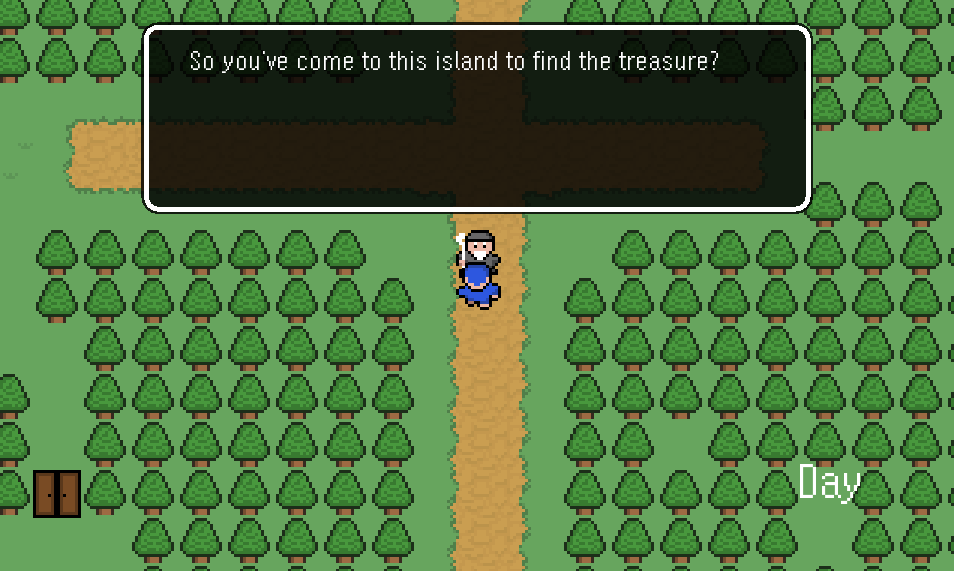
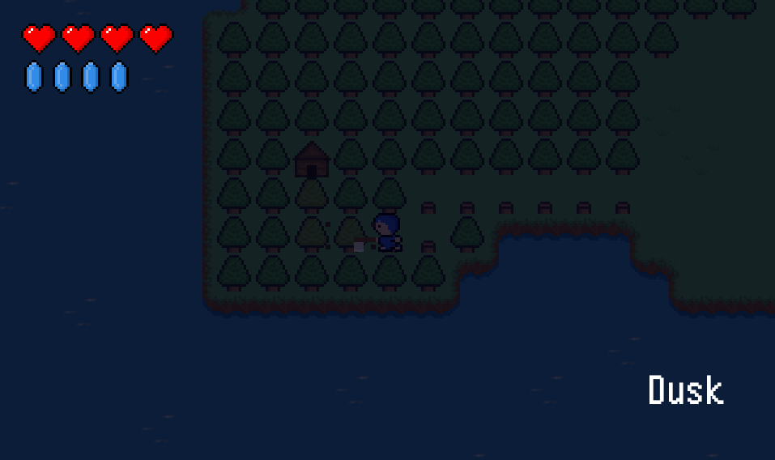
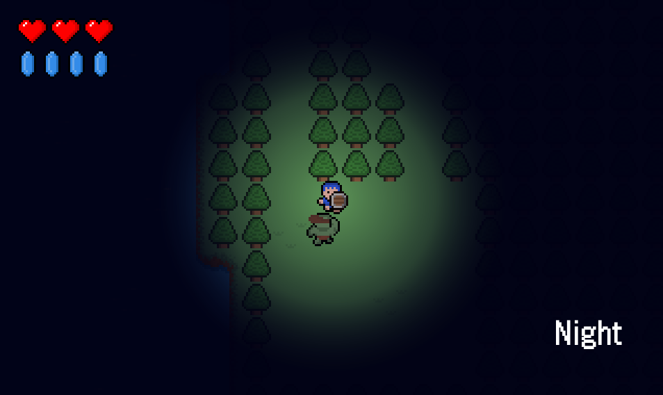
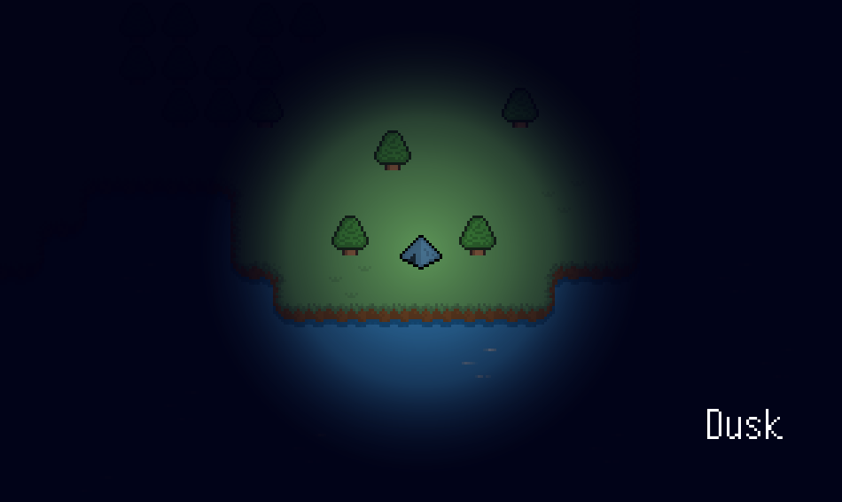
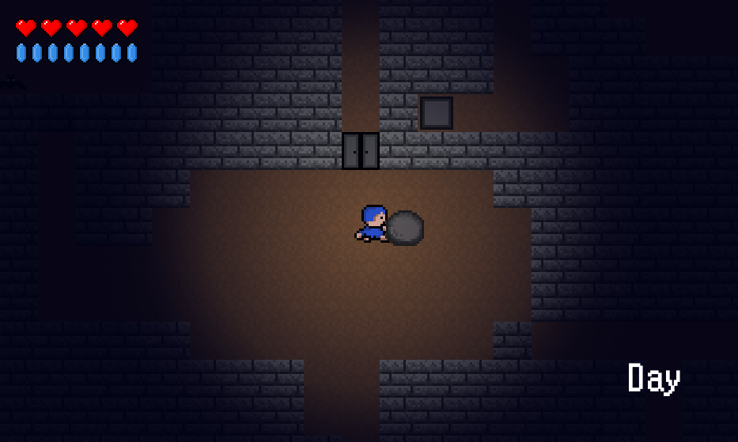

# Blue Boy Adventure

<h3> JAVA 2D ACTION RPG </h3> 

## Installation
* Download ZIP and Extract "Blue-Boy-Adventure-master" to Desktop.

* Open IntelliJ IDEA and Select Open Project.

* Choose "Blue-Boy-Adventure-master" folder and Select "Yes" to ReUse Module Files.

* At this point, be sure you are opening the root folder (/Blue-Boy-Adventure-master).

* Go src -> main folder -> Run Main

* Lastly don't forget to Setup SDK if needed.

  

## Goal
Kill monsters! Get stronger! Buy powerful items! Find the dungeon keys! Solve the dungeon puzzle! KILL THE BOSS!

  

## Controls

  

  

## Game Mechanics

<h3> Guard </h3>

* You block half the damage!
 
<h3> Parry </h3>    

* If you guard in 200 milliseconds before monster's attack, you parry attack!  
Then you get critical chance for 1 seconds. Critical hits give x2 damage.

<h3> Ninja </h3>   

* You can cut projectiles with your weapon. But be careful, you have to set the timing well.
  
<h3> Survivor </h3> 

*  Some of trees, some of walls can be destructible. Choose your weapons intelligently!

<h3> Pool </h3>  

*  You can recover your life/mana and save your progress. But monsters will spawn again.
  
<h3> Coin </h3>  

* Find the merchant, buy stronger items!

<h3> Tent </h3>   

* You sleep until next day.
 
<h3> Lantern </h3>  

*  When it gets dark you will realize how important lantern is.

  

## Screenshots

## Followed Steps

  

## Special Thanks

The tutorial and all of assets are made by RyiSnow.

* <a href="https://www.youtube.com/@RyiSnow">
Check RyiSnow Youtube Channel
</a>
