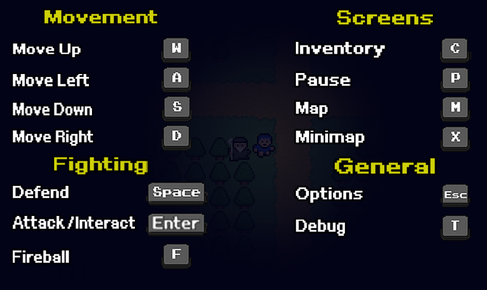
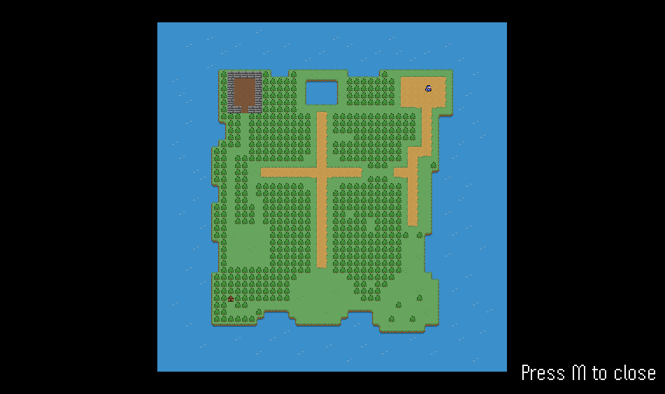
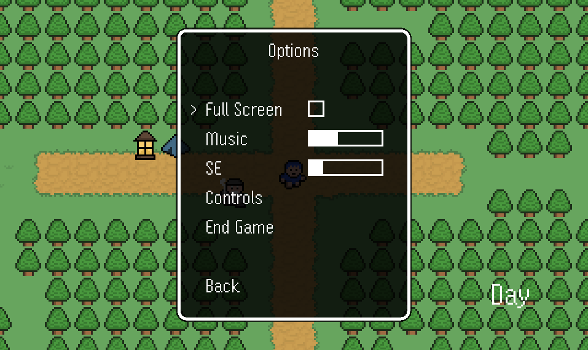
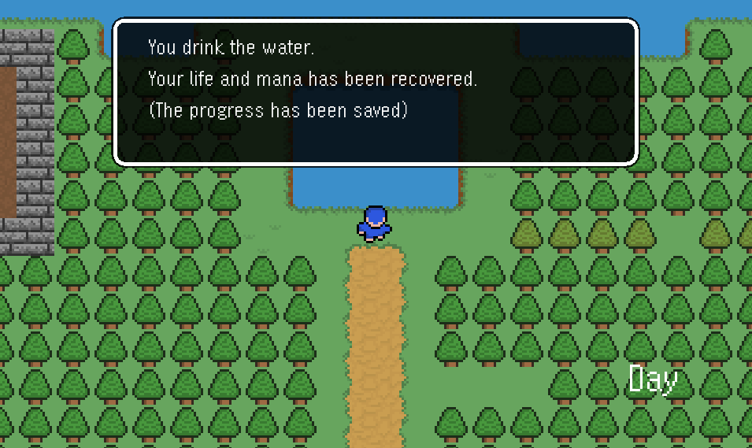
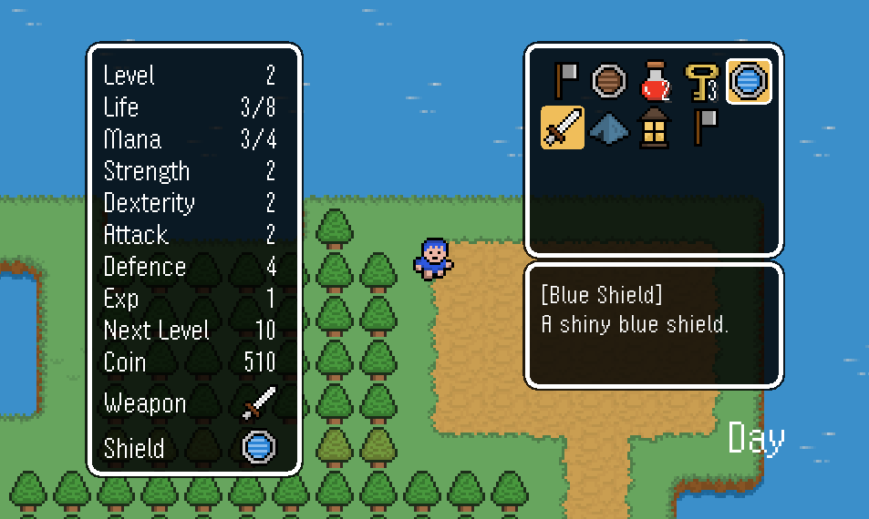
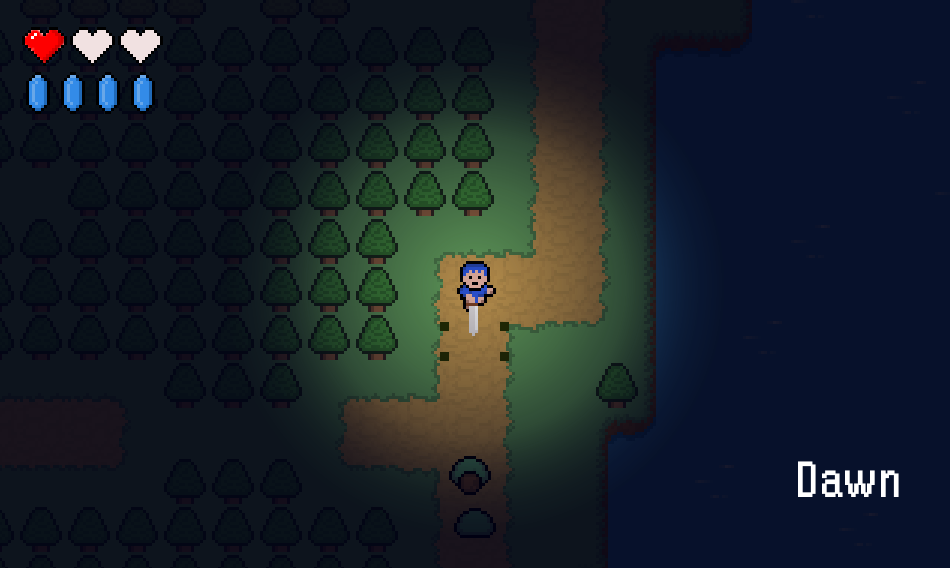
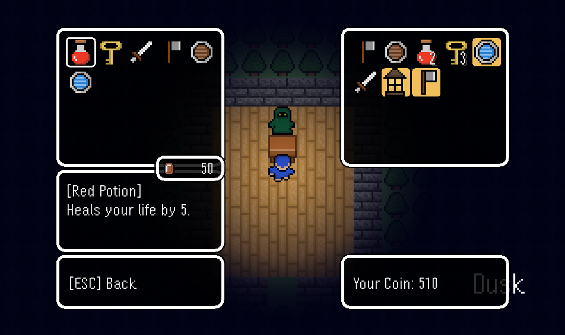
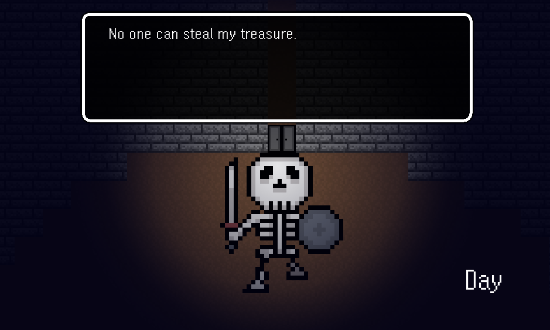
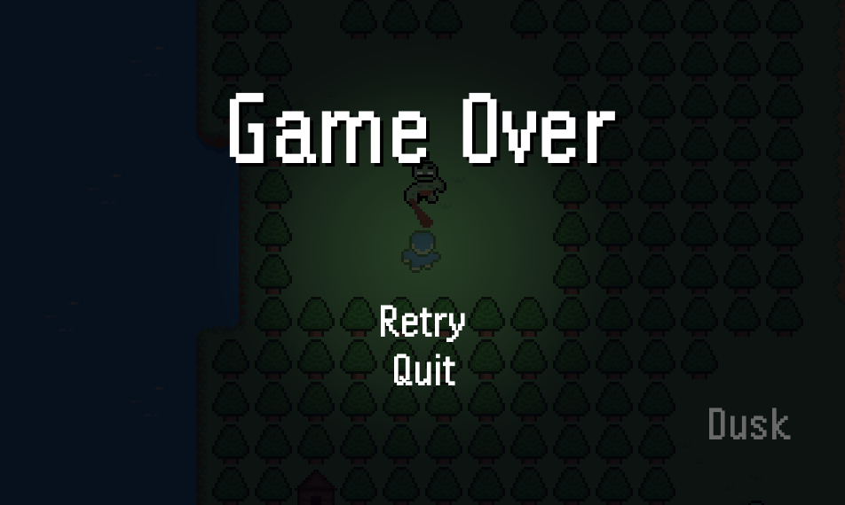

# Blue Boy Adventure

This is a Java 2D Action RPG made in intellij.

## Instructions

1. Download the ZIP file.
2. Open Project in any IDE.
3. Clean and Build Project.
4. Go to the `src -> main` folder and run the **Main** file.

---

## Special Thanks

This game was created using the tutorial and assets generously provided by **RyiSnow**.  
For more tutorials and resources, visit the [RyiSnow YouTube Channel](https://www.youtube.com/@RyiSnow).

---

## Goal

Your mission is simple: battle monsters, gain experience to grow stronger, collect powerful gear, and embark on a journey to uncover dungeon keys and solve challenging puzzles. In the end, confront and conquer the dungeon boss!

---

## Controls

---

## Screenshots

  
---
 
---
 
---

---

---
 
---

---

---
